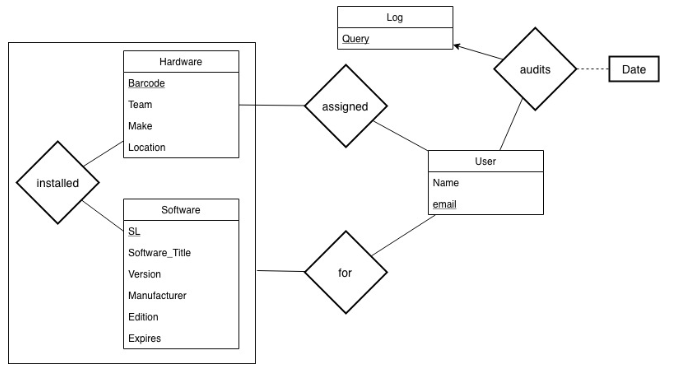

# Final Progress Report

### Describe your team activities prior to this date

Due to ambiguity with the datasets that Federal Aviation Administration has sent us, we decided to compile a list of questions that should clear up the specifics of the project. We have also created an entity relationship diagram to show our current understanding of how the entities and their functions will work in this project.

#### List of questions:
- How do you intferface with the database?
- What DBMS do you use?
- Can we have a comprehensive list of existing features in your database?
- Can we look at your existing code base or some sort of example?
- Will everyone accessing the database have the same permissions?
- How do we know which software license numbers reference which softwares?
- What does "Turn Date", "Remarks", and "EXCESSED" mean in the spreadsheets you sent us?
- What are you doing with the hardware table?
- What is the expected primary key of the excess table?
- What kind of queries do you execute and how often do you execute them?
- How do you want the tables ordered?
- What are specifically are incidents?
- How are you inputting incidents into the system?
#### ER Diagram

### Planned Activities

- Continue getting everyone up-to-date with information from Pluralsight
- Email Chris about more specific details about the project
- Schedule another call with Chris to discuss any updates to the working-project and project description
- Finish writing out a Vision Document with updated information
